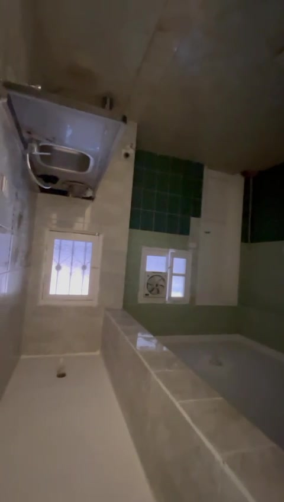
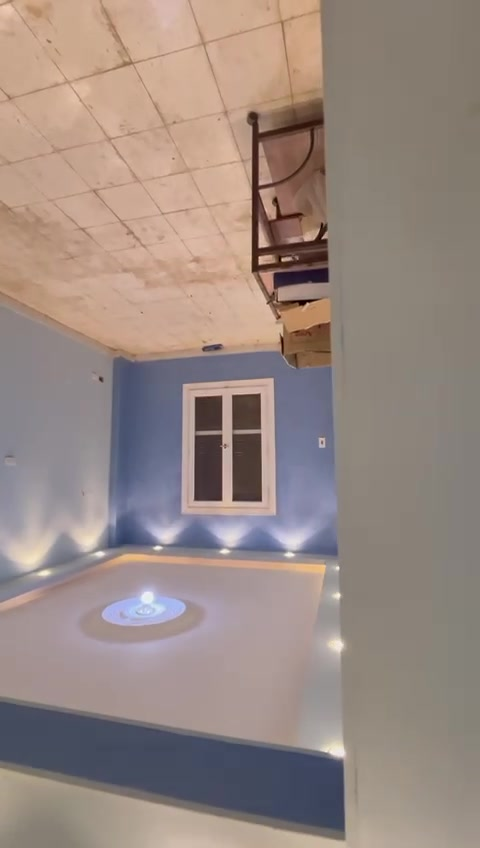
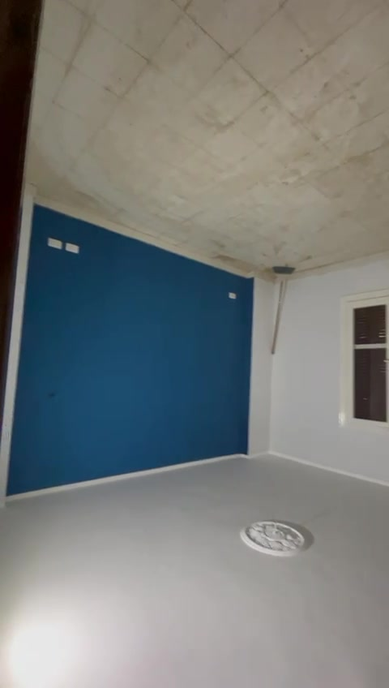
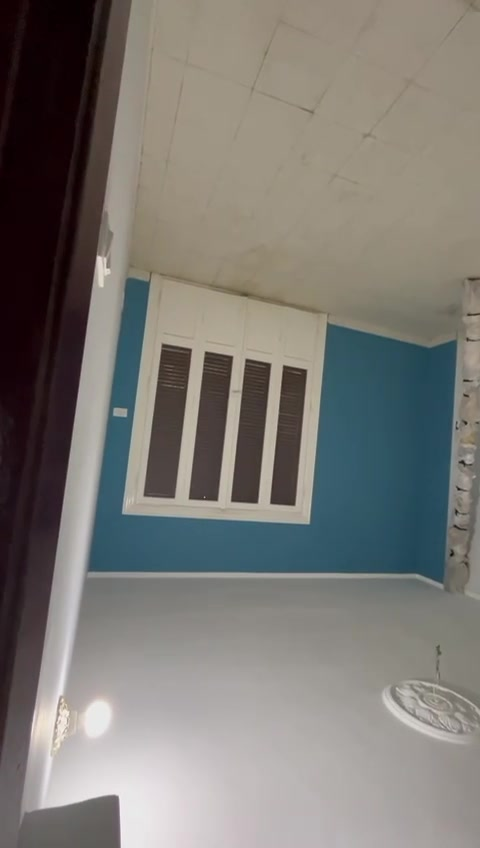
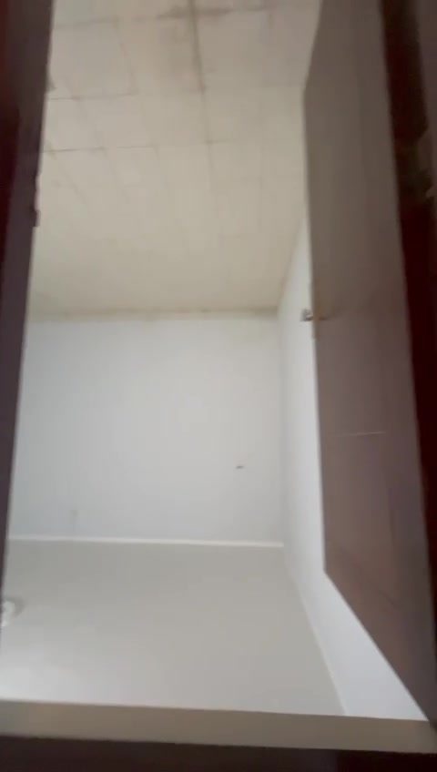
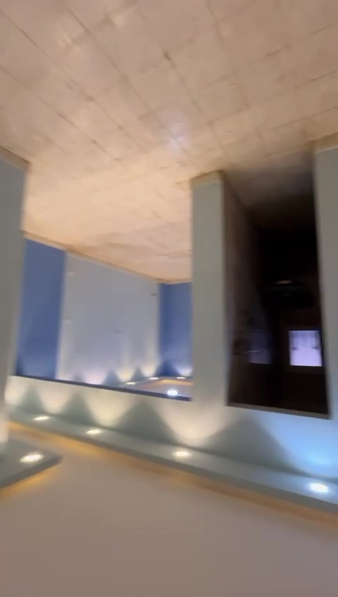
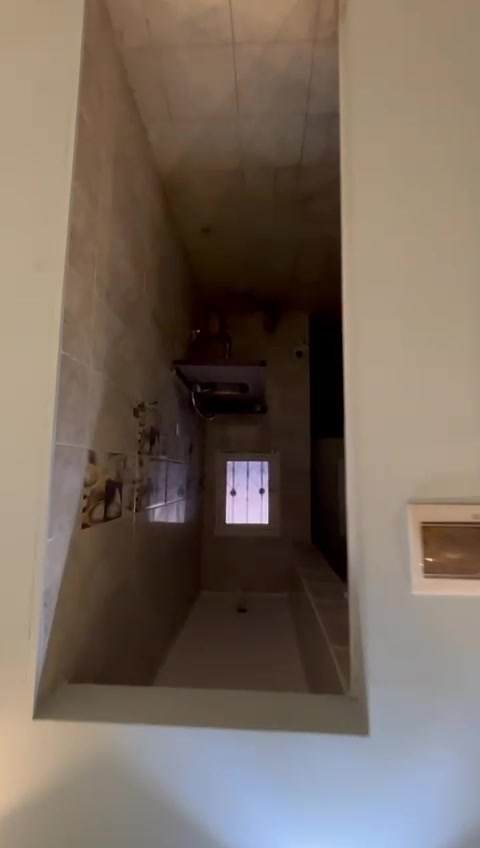
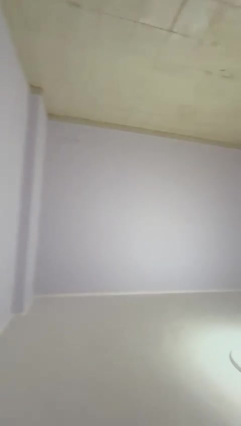

# تحليل فيديو الشقة — Apartment Video Analysis

> تحليل مأخوذ من فيديو التصوير (72 ثانية تقريبًا) لشقة على مرحلة التشطيب، يظهر فيها اللون النهائي لبعض الحوائط بينما لا تزال الأسقف في بعض الغرف من الخرسانة المكشوفة.

## نظرة عامة على الشقة

الشقة تحتوي على الغرف التالية (بترتيب الظهور في الفيديو):

| # | الغرفة | الوصف | لون مميز |
|---|--------|-------|----------|
| 1 | المدخل / الصالة | مدخل ضيق بباب خشبي بني وإضاءة أرضية مدفونة | رمادي فاتح |
| 2 | **الصالون / الريسبشن** (الغرفة الفاخرة) | سقف معلق مزخرف بإضاءة LED ملونة مدفونة، إضاءة أرضية حول الجدران | أزرق فاتح / لبني |
| 3 | الصالة المعيشة | غرفة ثانية بسقف غير مشطب بعد، بها شباك مزدوج بشيش خشبي | أبيض |
| 4 | غرفة نوم "زرقاء" | حائط بلون أزرق بترولي قوي كحائط مميز، وشباك بشيش خشبي | أزرق بترولي |
| 5 | غرفة نوم "تركواز" (أطفال) | حائط تركواز فاتح، مقاسها أصغر | تركواز |
| 6 | غرفة نوم "عنابي" (ماستر) | حائط عنابي/ماروني قوي، وأخرى بيضاء/ليلكي فاتح | عنابي |
| 7 | المطبخ | سيراميك حوائط كريمي، مساحة تركيب الحوض والبوتاجاز والثلاجة | كريمي |
| 8 | الحمام الرئيسي | بانيو، كرسي حمام، حوض، تهوية، بلاط أخضر مميز حول البانيو | أبيض + أخضر |
| 9 | حمام / توالت صغير | مساحة ضيقة بكرسي حمام وحوض صغير | رمادي فاتح |

## ملخص الحالة الحالية

- الشقة **فارغة تمامًا من العفش** — لا يوجد أي أثاث داخلها بعد.
- بعض الأسقف غير مكتملة (خرسانة مكشوفة) عدا سقف الصالون الفاخر.
- الشبابيك مركبة والأبواب الداخلية مركبة.
- بعض الكهرباء (كاوتش) مكشوف في بعض الحوائط.

## اقتراحات توزيع العفش لكل غرفة

### 1. الصالون (Reception) — أولوية الضيوف

> **تحديث من الفيديو الجديد (`new_apartment_video.mp4` @ 00:03–00:08) — تحليل عميق من 22 لقطة**:
> - **شكل مستطيل نظيف** بدون أي بروز أو كولومن.
> - **3 حوائط مينت/سيلادون** (`#BFD6D8`) + **1 حائط أزرق ديم accent** (`#6892B0`).
> - **الباب الفرنسي الأبيض ثلاثي البانوهات** (~180سم) بشيش خشبي على الحائط الأزرق — يقابل باب المطبخ عبر ممر المدخل.
> - **سقف معلق ساقط (tray ceiling)** + **شريط LED مخفي أصفر دافئ** (`#FFCE7A`) + **~6 سبوتات مدفونة** + **كورنيش أبيض**.
> - **شباك واحد فقط** (شباك البلكونة على الحائط الغربي).
> - **أرضية سيراميك بيج كريمي** (`#E8DCC8`) بفواصل واضحة.

- **طقم انتريه / صالون كلاسيك 7 قطع** (كنبة 3 مقاعد + كنبتين 2 مقعد + 2 فوتيه) بمواجهة الشباك.
- **ترابيزة وسط رخامية** في المنتصف.
- **سجادة عجمي كلاسيك** تحت الطقم.
- **بوفيه / نيش عرض** على الحائط المقابل للدخول.
- **ستارة رول أو كلاسيك** على الشباك.

### 2. الصالة المعيشة

> **تحديث من الفيديو الجديد (`new_apartment_video.mp4` @ 00:13–00:20) — تحليل عميق من 22 لقطة**:
> - **شكل مستطيل نظيف** (تم حذف الكولومن الخاطئ — لا يوجد بروز).
> - **حوائطها مزيج**: حائطان أزرق ديم accent + حائطان مينت/سيلادون.
> - **ميزة مميزة**: **روزة جبس مزخرفة (Plaster Ceiling Rose)** كبيرة في مركز السقف الساقط — مع نقطة تعليق نجفة. هذه الميزة هي ما يميز المعيشة عن الصالون.
> - **سقف معلق + LED cove + سبوتات + كورنيش** (نفس تشطيب الصالون).
> - **شباك أبيض واحد** double-shutter casement على الحائط الأزرق.
> - **فتحة مقوّسة (arched opening)** على إحدى الزوايا تربط بممر داخلي يقود لغرف النوم.
> - **نفس الأرضية البيج كريمي**.

- **كنبة ركنة L-Shape** مواجهة الحائط الرئيسي.
- **وحدة تلفزيون (TV Unit)** + شاشة 55" معلقة على الحائط المقابل.
- **ترابيزة قهوة صغيرة** بين الكنبة والشاشة.
- **مكتبة / رف كتب** في الركن.
- **سجادة عصرية**.

### 3. غرفة النوم الزرقاء (ماستر)

- **سرير دوبل 180×200** مواجه للحائط الأزرق (الحائط الأزرق = head wall).
- **كومودينو + أباجورتين** على جانبي السرير.
- **دولاب 6 ضلف** في الجهة المقابلة للسرير (بعيدًا عن الشباك).
- **تسريحة + مرآة** أسفل الشباك.

### 4. غرفة النوم التركواز (أطفال)

- **سرير مفرد** أو **بنك سرير (Bunk Bed)** ملاصق للحائط الطويل.
- **مكتب دراسة + كرسي** مواجه الشباك للاستفادة من الإضاءة الطبيعية.
- **دولاب 4 ضلف**.
- **رف ألعاب / مكتبة**.

### 5. غرفة النوم العنابية

- **سرير كينج 200×200** مواجه للحائط العنابي.
- **كومودينو × 2**.
- **دولاب سحاب كبير** على الحائط الأبيض الطويل.
- **تلفزيون معلق** أمام السرير.

### 6. المطبخ

- **وحدات مطبخ خشب / أكريليك** على شكل L: حوض بجوار الشباك، بوتاجاز، ومكان ثلاجة.
- **شفاط فوق البوتاجاز**.
- **ميكروويف** فوق الرخامة.
- إن سمح المكان: **طاولة طعام صغيرة 2 كرسي** بالركن.

### 7. الحمام الرئيسي

- **بانيو** (مركب بالفعل من الصور).
- **حوض + مرآة**.
- **كرسي حمام**.
- **غسالة أوتوماتيك** في المساحة المتاحة.
- **سخان** معلق فوق البانيو.

### 8. التوالت / الحمام الصغير

- **كرسي حمام**.
- **حوض صغير**.

## أبعاد تقديرية (للاستخدام في المخطط)

> الأبعاد افتراضية لأنه لا يوجد قياسات دقيقة في الفيديو — يمكن ضبطها من خلال لوحة تحكم الصفحة.

| الغرفة | العرض تقريبًا | العمق تقريبًا |
|--------|---------------|---------------|
| الصالون | 5.0 م | 4.0 م |
| الصالة | 4.5 م | 3.5 م |
| غرفة زرقاء | 4.0 م | 3.5 م |
| غرفة تركواز | 3.5 م | 3.0 م |
| غرفة عنابية | 4.5 م | 3.5 م |
| المطبخ | 3.0 م | 2.5 م |
| الحمام الرئيسي | 2.5 م | 2.0 م |
| التوالت | 1.5 م | 1.5 م |

---

راجع الصفحة التفاعلية (`index.html`) لتجربة ترتيب العفش بشكل ديناميكي.
