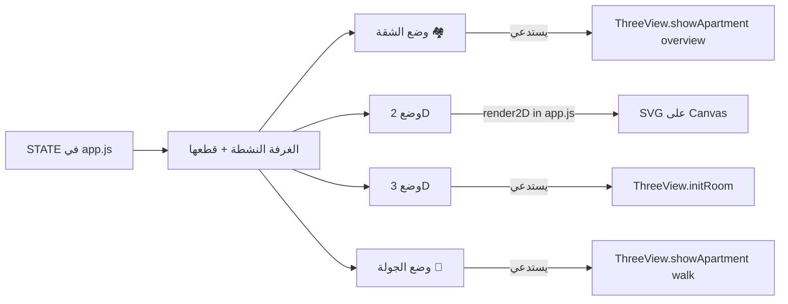

# خطة المشروع — Apartment Designer (تحليل وفهم)

> ملف يلخّص بنية المشروع لمساعدة أي مطوّر/مساعد على فهمه بسرعة قبل التعديل.

## نظرة عامة

موقع ثابت **بدون أي build step** — HTML/CSS/JS عادي يُفتح مباشرة في المتصفح. الهدف: عرض شقة سكنية مأخوذة من فيديو، والسماح للمستخدم بتجربة ترتيب العفش (drag & drop) عبر 4 أوضاع: **خريطة الشقة الكاملة، 2D، 3D، جولة أولى-شخص (walkthrough)**.

## بنية الملفات

```
test_3d_apartment/
├── index.html                 # الواجهة + كل المودالز (محرر الغرفة، عنصر مخصص، تكلفة، اختصارات)
├── manifest.webmanifest       # PWA manifest
├── service-worker.js          # تخزين أوفلاين بسيط
├── css/styles.css             # كل التنسيقات (داكن/فاتح، responsive)
├── js/
│   ├── rooms.js               # تعريف الغرف (أبعاد، فتحات، ألوان جدران، fixtures)
│   ├── furniture.js           # كتالوج العفش (id, name, w, h, depth, color, category)
│   ├── custom-items.js        # إضافة عناصر مخصصة بصورة
│   ├── dxf-import.js          # استيراد غرفة من ملف AutoCAD DXF
│   ├── color-picker.js        # eyedropper من صورة لاستخراج لون جدار
│   ├── shape-editor.js        # محرر مضلّع للغرفة (vertices) — يعمل في 2D
│   ├── app.js                 # القلب: حالة + 2D rendering + drag/drop + undo/redo + localStorage
│   └── three-view.js          # رندر 3D (single room + apartment overview + walkthrough) — Three.js
└── docs/
    ├── ANALYSIS.md            # تحليل الفيديو الأصلي (apartment_video.mp4)
    ├── AUTOCAD.md             # دليل اتفاقيات طبقات DXF
    ├── IMPROVEMENT_PLAN.md    # خطة تحسينات سابقة
    ├── TEST_PLAN.md / TEST_REPORT.md
    ├── PROJECT_PLAN.md        # ← هذا الملف
    └── frames/                # لقطات مرجعية من الفيديو الأصلي
```

## أدوار الملفات الرئيسية

### `js/rooms.js` — مصدر الحقيقة عن الشقة

كل غرفة كائن داخل مصفوفة `ROOMS`، ويحوي:

- `id`, `name`, `description`
- `width`, `depth` (سم) — الأبعاد المستطيلة الافتراضية
- `plan: { x, y }` — الإحداثي على خريطة الشقة الكاملة
- `wallColor` + `wallColors: { top, bottom, left, right }` + `accentColor`/`accentWall`
- `floorColor`, `floorTexture`
- `openings: [{ wall, at, size, kind, label }]` — أبواب وشبابيك
- `vertices?: [{x, y}]` — اختياري، شكل مضلّع مخصّص (يستبدل المستطيل)
- `allowedCategories`

دالة `resolveWallColor(room, wallId)` تحلّ تعارض الأولوية: `wallColors > accentColor > wallColor`.

### `js/furniture.js` — الكتالوج

مصفوفة قطع — كل قطعة لها `id`, `name`, `w`, `h` (top-down)، `depth` (الارتفاع 3D)، `color`, `category`, `price?`, `icon`.

### `js/app.js` — منطق التطبيق + رندر 2D

- يدير الحالة العامّة (أي غرفة نشطة، قائمة العفش بكل غرفة، التحديد، …) في كائن `STATE`.
- يرسم 2D في SVG داخل `#room-container` — يدعم `room.vertices` (مضلّع) أو مستطيل افتراضي.
- يعالج drag/drop من الكتالوج إلى المسرح، تحريك القطع، الدوران، الاختيار المتعدد.
- التراجع/الإعادة (`undo`/`redo` stacks).
- الحفظ التلقائي في `localStorage` + التصدير/الاستيراد JSON.
- يستدعي `window.ThreeView.*` لتفعيل رندر 3D.

### `js/three-view.js` — كل ما يخصّ Three.js

ثلاث نقاط دخول رئيسية:

1. **`initRoom(container, room, items, callbacks)`** — مشهد لغرفة واحدة في وضع 3D، فيه orbit camera + إخفاء الجدار الأقرب من الكاميرا.
2. **`showApartment(container, { rooms, itemsByRoom, findItem })`** — وضع الجولة (walkthrough) أو المخطّط ثلاثي الأبعاد لكل الشقة.
3. **`screenshotPNG()` / `exportGLB()`** — التصدير.

دوال البناء الداخلية:

- `buildWalls(scene, room)` — يبني 4 جدران بـ `ExtrudeGeometry` يدعم holes للفتحات.
- `buildRoomAt(scene, room, offX, offZ, collidables)` — نفس الفكرة لكن داخل مشهد الشقة الكامل.
- `buildFurnitureMesh(inst, item)` — Box geometry للعفش، تدعم صور للعناصر المخصصة كـ texture على الواجهة.

### المساعدات

- **`custom-items.js`** — مودال إضافة قطعة بصورة + أبعاد، تُحفظ في `localStorage` كـ "كتالوج خاص".
- **`dxf-import.js`** — يقرأ DXF نصّي، يستخرج LWPOLYLINE/POLYLINE، ويحوّلها لـ vertices + openings.
- **`color-picker.js`** — يفتح صورة في canvas، ينقر المستخدم → يقرأ اللون.
- **`shape-editor.js`** — overlay على SVG في 2D للسحب على رؤوس المضلّع (إضافة/حذف/تحريك).

## تدفّق العرض (4 أوضاع)



التبديل بين الأوضاع: زرّ يضبط `STATE.mode` ثم يستدعي إعادة الرندر — كل وضع ينظّف الـ DOM السابق ثم يبني الخاص به.

## نقاط الإمتداد المعروفة

- **خصائص جديدة على room** (مثل `room.ceiling`, `room.vertices`) — تُقرأ في `three-view.js` و/أو `app.js`. الإضافة مباشرة لأن البنية ديناميكية.
- **floor/wall texture presets** — حالياً تُحفظ في rooms.js (`floorTexture`, `wallTexture`) لكن `three-view.js` لا يطبّق presets؛ هذه نقطة تحسين.
- **ميزات فيوال جديدة** (سقف معلق، إضاءة LED، كورنيش) — تضاف داخل دوال `buildWalls`/`initRoom`/`buildRoomAt` بشرط الـ flag.

## ملخّص لماذا الصالة بحاجة لتحديث

الفيديو الجديد (`new_apartment_video.mp4`) يُظهر للصالون + المعيشة:

- **شكل غير مستطيل** (حائط بارز يقطع الصالة، عمود/كولومن عند المعيشة).
- **سقف معلق ساقط (tray)** + شريط LED أصفر مخفي + سبوتات مدفونة + كورنيش أبيض.
- **لون جدران مينت أفتح** + حائط أزرق ديم مميز.
- **أرضية سيراميك بيج** بفواصل مرئية.

أيٍّ من هذه الميزات غير مدعوم حالياً في `three-view.js`. التحديث المطلوب:

1. دعم `room.vertices` في `buildWalls` + `buildRoomAt` (ليصبح شكل الغرفة 3D = شكلها 2D).
2. دالة `buildCeiling(scene, room)` جديدة تُفعَّل لو `room.ceiling`.
3. أرضية بـ `CanvasTexture` لو `room.floorTexture === "tile-cream"`.
4. ضبط ألوان وقيم vertices في `rooms.js` للصالون والمعيشة فقط.

التفاصيل الكاملة في خطة التنفيذ المرافقة.
